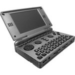

# Pandora (1GHz, Rebirth, Classic)

  
|Component|Description                                         |
|---------|----------------------------------------------------|
|CPU      |TI DM3730 Cortex-A8 1GHz                            |
|RAM      |512MB                                               |
|Storage  |512MB                                               |
|Screen   |4.3" 800x480 Resistive Touch                        |
|Slot     |Dual SDCard                                         |
|Gamepad  |DPad, 4 Buttons, Start, Select, L, R, Analog Jostick|
|Keyboard |4 Rows QWERTY                                       |
|USB      |USB(Host), MiniUSB(Client, Host)                    |
|Bluetooth|v2.0 + EDR                                          |
|WLAN     |Wi-Fi 802.11 b/g                                    |
|Battery  |3.7V 4000mA                                         |
|Dimension|140.29mm x 83.48mm x 29.25mm                        |
|Weight   |320g                                                |
  
### Website  -  https://steward-fu.github.io/website/index.htm
